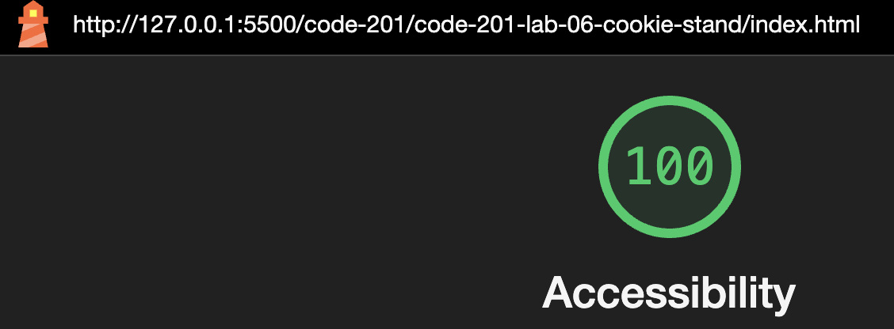

# LAB - 06

## Salmon Cookie Stand

I build a web application with the purpose of helping with the branding of a Salmon Cookie business and help with internal sales data management. The public-facing website includes the brand's color scheme, fonts, branded images, and key information for each location.

For the sales data, the application will need to be adaptable and able to add and remove locations from the daily projections report. To do this, the application utilizes the DOM and allows the data to be dynamically called.

### Author: Rhett Chase

### Links and Resources

- [submission PR](https://github.com/rhettchase/code-201-lab-06-cookie-stand)
- [W3C - Manipulating CSS with JavaScript](https://www.w3.org/wiki/Dynamic_style_-_manipulating_CSS_with_JavaScript)
- ChatGPT

### Lighthouse Accessibility Report Score

### Reflections and Comments

- I utilized `objects` to store the data for each location
- These `objects` contained a variety of data types, including `strings`, `arrays`, `numbers` and `functions`
- I used several `for loops` to iterate through calculations such as generating the number of cookies sold per hour
- The number of cookies sold per hour were then `pushed` into the array of hourly sales for each location